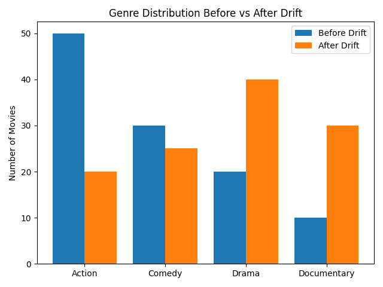
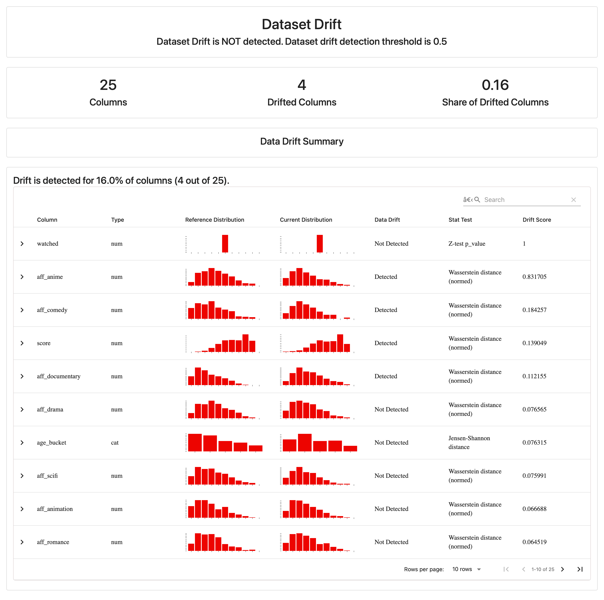

# 🎬 Catching Data Drift in Movie Recommendations with Evidently AI  
*How lightweight monitoring reveals shifting user tastes and keeps recommendations relevant.*

---

##  Overview

### Keeping Movie Recommendations Fresh: How Data Drift Impacts Streaming Platforms

The scary part? **Data drift happens silently.**  
A model that originally performed brilliantly can degrade gradually without anyone noticing — unless the system is being actively monitored.

### The MLOps Reality: Models Don’t Live in Notebooks

In a controlled environment like a notebook, everything feels stable.  
In production, machine learning systems must:

- Continuously ingest massive volumes of real user interactions  
- Monitor the quality of incoming data  
- Track model performance over time  
- Detect sudden behavioral changes  
- Trigger alerts or retraining workflows when drift emerges  

Without monitoring, even the best-performing model can fail catastrophically in practice.

---

##  Why Streaming Platforms Are Especially Challenging

Movie-streaming platforms generate **millions of user events daily** such as clicks, watch durations, and ratings.

Their data is:

- **Noisy** – Not every action reflects true preferences  
- **Diverse** – User behavior varies widely  
- **Dynamic** – Trends evolve rapidly and unpredictably  

Since recommendations directly impact **engagement, retention, and revenue**, streaming platforms can’t afford silent failures.

---

##  Enter Evidently AI: Monitoring Data Drift in Practice

To address this challenge, I used **Evidently AI**, an open-source ML monitoring and evaluation tool.

It enables:

- Detection of shifts in user preferences  
- Identification of drifting features  
- Visualization of behavioral change over time  
- Data-driven retraining decisions  

Its lightweight dashboards integrate smoothly into MLOps pipelines, making drift detection practical and actionable.

---

##  Problem Addressed: Data Drift

The core challenge is **data drift**: when user behavior changes and the model no longer reflects current patterns.

If left unmonitored, this causes:

- Irrelevant recommendations  
- Reduced engagement  
- Higher churn rates  

Drift monitoring ensures the recommendation model stays aligned with reality.

---

##  Practical Movie-Streaming Scenario

I simulated a streaming platform with user logs including:

- Region  
- Device  
- Age group  
- Genre preferences  

A baseline watch-probability model was trained on historical data.

To simulate drift:
- A surge in interest in animated content was introduced  
- Evidently compared the new data to the reference set  
- Drift was detected in genre features and prediction outputs  

This setup mirrors how real platforms detect misalignment early and trigger retraining.

---

##  Baseline Model Results

Performance of the prediction model:

- **ROC-AUC:** `0.705`
- **PR-AUC:** `0.562`

Although not perfect, the model captures meaningful patterns, making drift monitoring essential.

---

##  Simulating Drift

To simulate real-world behavior changes:

- I increased interest in animated shows  
- This shifted the genre distribution significantly  

📷 Genre Distribution Example:  



In production, trends like viral releases or cultural shifts can degrade models quickly without monitoring.

---
## Analysis- Strengths,  Limitations, and  Lessons Learned

###  Strengths
- **Simple Python integration** – Easily fits into existing pipelines  
- **Clear visual dashboards** – Intuitive for both engineers and stakeholders  
- **Comprehensive drift diagnostics** – Covers data, feature, and model shift  

---

###  Limitations
- **Provides insights but not decisions** – Action logic must be built separately  
- **Static reports without pipeline automation** – Requires CI/CD or orchestration integration  
- **Large datasets may require sampling** – Full analysis at scale can be resource-intensive  

---

###  Lessons Learned
- **Drift happens silently — monitoring is essential**  
- **Automated retraining improves recommendation relevance**  
- **Thresholds like `drift_share > 0.3` help define actionable responses**

---

##  Project Structure

Repository layout:

```text
movie-mlops-lab/
│
├── README.md                  # Project overview, setup, and documentation
├── index.html                 # Blog-style writeup: drift monitoring with Evidently
├── data_drift_report.html     # Generated Evidently drift report (HTML)
├── requirements.txt           # Python dependencies
│
├── data_simulation.py         # Script to generate synthetic interactions/logs
├── sample_data.py             # Helper for creating or inspecting sample datasets
├── train_baseline.py          # Trains the watch-probability baseline model
├── monitor_drift.py           # Runs Evidently AI and builds drift report
├── quick_check.py             # Lightweight CLI-style drift alert (e.g., drift_share > 0.3)
├── utils.py                   # Shared helper functions (data loading, preprocessing, etc.)
├── watch_model.joblib         # Saved baseline model artifact
├── feature_order.csv          # Feature ordering/config for model/monitoring
│
├── images/
│   ├── drift_report.png       # Screenshot of Evidently drift dashboard
│   └── genre_distribution.png
│   └── evidently_report.png
├── interactions_ref.parquet   # Historical (reference) user–item interactions
├── interactions_cur.parquet   # Current interactions with simulated drift
├── logs_ref.parquet           # Reference event logs
├── logs_cur.parquet           # Current event logs
├── movies.parquet             # Movie metadata (genres, titles, etc.)
├── users_ref.parquet          # Reference user attributes
└── users_cur.parquet          # Current user attributes with drift
```

##  Setup Guide

Follow these steps to reproduce the experiment:

### 1. Clone the repository
```bash
git clone https://github.com/Leamota/movie-mlops-lab.git
cd movie-mlops-lab
```

### 2. Create a virtual environment
python3 -m venv venv
source venv/bin/activate    # On Mac/Linux
venv\Scripts\activate       # On Windows


### 3. Install dependencies
pip install -r requirements.txt

### 4. Generate synthetic data
python data_simulation.py

This script creates:
- `reference_data.csv`
- `current_data.csv`
  
These simulate historical and drifting user behavior.

### 5. Train the baseline model
python train_baseline.py

This trains the classification model and saves model artifacts for monitoring.

### 6. Run data drift monitoring
python monitor_drift.py

This runs Evidently and generates a drift report.

### 7. View the report
Open the generated HTML:

data_drift_report.html


You can view this in your browser to explore feature-level drift results.

Here is an example of the generated Evidently dashboard:




### 8. (Optional) Quick drift alert
python quick_check.py

This script performs a lightweight drift check and prints a quick alert if
drift_share > 0.3

Useful for automated pipelines and CI/CD workflows


 ## Conclusion

In real MLOps workflows, Evidently becomes part of the model lifecycle.

Instead of passively generating dashboards, it integrates with automation:

- Triggers alerts

- Initiates retraining

- Supports rollback strategies

This creates a feedback loop:

### Monitoring → Detection → Adaptation

### Beyond Streaming

This approach applies to many industries:

- Finance

- Healthcare

- E-commerce

- Transportation

- Social media

Data drift is unavoidable, but manageable with proper monitoring.

 ### Final Takeaway

Building a model is just the beginning.
Keeping it relevant requires **continuous monitoring, automation, and system thinking.**

Evidently AI makes this practical by turning silent failures into visible signals — and actionable improvements.

Drift isn’t a possibility. It’s a certainty.
Monitoring is how you stay ahead.

---

###  Author & Course Info

**Lawrence A. Egharevba**  
Course: *COT 6930 – AI and Machine Learning Production*  
Institution: **Florida Atlantic University**  
Semester: **Fall 2025**
